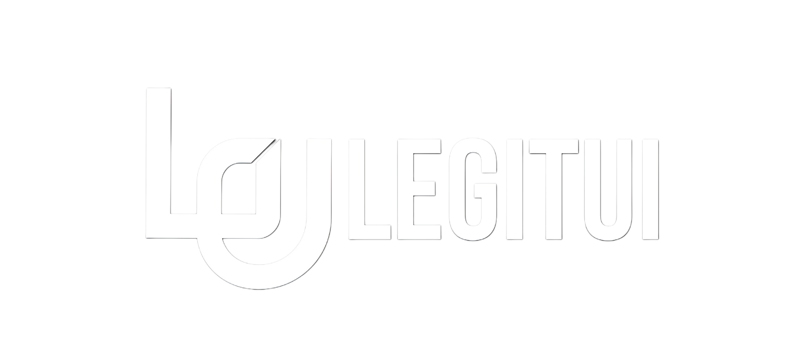

<p align="center">
  
</p>

<h1 align="center">LegitUI</h1>

<p align="center">
  <strong>A premium collection of 60+ free, open-source React UI components for creative developers.</strong>
</p>

<p align="center">
  <a href="#-getting-started">Getting Started</a> •
  <a href="#-component-library">Components</a> •
  <a href="#-tech-stack">Tech Stack</a> •
  <a href="#-adding-components">Add Components</a> •
  <a href="#-contributing">Contributing</a>
</p>

<p align="center">
  
  
  
  
  
</p>

---

## ✨ What is LegitUI?

LegitUI is a beautifully crafted, open-source library of **61 production-ready React components** designed to make your projects look stunning with minimal effort. Every component is built with attention to detail — from cinematic WebGL backgrounds to silky-smooth text animations.

**Copy. Paste. Ship.**

> No bloated npm packages. No config headaches. Just grab the components you need and drop them into your project.

---

## 🎥 Preview

| Cinematic Backgrounds | Text Animations | Interactive Components |
|:---:|:---:|:---:|
| Aurora, Nebula, Black Hole, Fractal Haze | Scroll Reveal, Pixelify, 3D Flip, Morph | Magnetic Dock, 3D Gallery, Orbit Gallery |
| WebGL-powered with Three.js & OGL | GSAP & Framer Motion driven | Physics-based interactions |

---

## 🚀 Getting Started

### Prerequisites

- **Node.js** 18+ 
- **npm** 9+ (or yarn/pnpm)

### Installation

```bash
# Clone the repository
git clone https://github.com/SHAIK-ABDUL-REHAMAN31/LegitUI.git

# Navigate into the project
cd LegitUI

# Install dependencies
npm install

# Start the development server
npm run dev
```

Open [http://localhost:3000](http://localhost:3000) to see the component showcase.

### Build for Production

```bash
npm run build
npm run start
```

---

## 📦 Component Library

### 🎨 Backgrounds (12)
| Component | Description | Tech |
|-----------|-------------|------|
| **Aurora Background** | Mesmerizing aurora borealis effect with animated gradients | CSS |
| **Particles Background** | WebGL particle field with cursor interactivity | OGL |
| **Neon Waves** | Interactive neon ribbon background | Three.js |
| **Mirror Capsules** | 3D iridescent capsules with procedural env mapping | Three.js |
| **Fractal Haze** | Organic fluted glass refraction over fluid gradient | OGL |
| **Liquid Nebula** | Fluid, organic animated background with water ripples | OGL |
| **Space Nebula V1** | Volumetric space nebula with twinkling stars | OGL |
| **Space Nebula V2** | Multi-layered gaseous nebula with intersecting flows | OGL |
| **Green Wave Ribbons** | Immersive 3D ribbon terrain | OGL |
| **Cinematic Black Hole** | Breathtaking black hole simulation | React Three Fiber |
| **Animated Gradient** | Apple-style animated gradient text | Framer Motion |
| **Horizon Gradient** | Smooth horizon arc gradient effect | CSS |

### ✨ Text Animations (18)
| Component | Description | Tech |
|-----------|-------------|------|
| **Text Reveal** | Scroll-driven character fade-in wipe reveal | GSAP |
| **Smooth Fade Up** | Gold-standard staggered fade-in-from-below | GSAP |
| **Cinematic Text** | Scroll-linked 3D letter animation with depth & blur | Framer Motion |
| **Scale Blur** | Smooth scaling and blur word reveal on scroll | GSAP |
| **Staggered Word Slide** | Words slide up from mask with staggered delay | GSAP + Framer |
| **Typing Cursor** | Ultra-smooth typing effect with glowing cursor | GSAP + Framer |
| **Typewriter Text** | Classic character-by-character typewriter effect | Vanilla |
| **Pixelify Text** | Pixel-style text reconstruction animation | GSAP + Canvas |
| **Numbers Count** | Spring physics number counter with motion blur | Framer Motion |
| **Animated Gradient Text** | Continuous color-shifting gradient text | Framer Motion |
| **Liquid Wave Text** | SVG turbulence-based liquid distortion | GSAP + SVG |
| **3D Flip Text** | Individual letters rotate into view in 3D | Framer Motion |
| **Infinite Marquee** | Smooth infinite scroll with parallax depth | Framer Motion |
| **Text Morph** | Fluid word-to-word shape-shifting animation | Framer Motion |
| **Scroll Reveal Text** | Word-by-word scroll-driven text reveal | GSAP |
| **Slide Up Text** | Smooth vertical slide-up text entrance | GSAP |
| **Text Roller** | Vertical scrolling text selector with blur falloff | GSAP |
| **Magnetic Hover Text** | Text that reacts magnetically to cursor proximity | Vanilla |

### 🔘 Buttons (3)
| Component | Description |
|-----------|-------------|
| **Shimmer Button** | Eye-catching shimmer animation for CTAs |
| **Magnetic Button** | Magnetically attracts towards cursor on hover |
| **Ripple Button** | Material-design inspired ripple effect on click |

### 🃏 Cards (4)
| Component | Description |
|-----------|-------------|
| **Glow Card** | Dynamic glow effect that follows mouse cursor |
| **Spotlight Card** | Spotlight gradient that follows cursor |
| **Premium Bank Card** | High-fidelity bank card with multi-layer design |
| **Hover Reveal Card** | Content reveals on hover with smooth transitions |

### 🎭 Animations & Interactions (8)
| Component | Description | Tech |
|-----------|-------------|------|
| **Animated Border** | Rotating gradient border animation | CSS |
| **Cinematic Scroll** | Horizontal scroll-driven panels | GSAP + Lenis |
| **Curved Typography Gallery** | Rotating cards on curved SVG path | GSAP |
| **Infinite Image Marquee** | Smooth scrolling image marquee | GSAP + Lenis |
| **Editorial Storytelling** | Scroll-driven editorial sections | GSAP + SplitType |
| **Cursor Image Trail** | Images follow cursor with kinetic physics | Vanilla |
| **Orbit Gallery** | Personal gallery with orbiting layout | GSAP |
| **Magnetic Dock** | macOS-style dock with magnetic scaling | Framer Motion |

### 📐 Complex Components (3)
| Component | Description | Tech |
|-----------|-------------|------|
| **3D Gallery** | Interactive 3D image carousel with drag | Framer Motion |
| **Scroll Gallery** | Curved infinite scrolling 3D image gallery | React Three Fiber |
| **Stacked Card Reveal** | Scroll-driven stacked card reveal animation | GSAP |

### 🔤 Advanced Text Effects (9)
| Component | Description | Tech |
|-----------|-------------|------|
| **ASCII Text** | Text rendered as ASCII characters | Canvas |
| **ASCII Motion Text** | GPGPU particle simulation ASCII text | Three.js |
| **Kinetic Split Text** | Split text with kinetic scroll animation | GSAP + SplitType |
| **Curved Typography** | Text flowing along curved paths | SVG |
| **Glitch Text** | Digital glitch distortion effect | CSS |
| **Physics Text** | Letters with real physics simulation | Matter.js |
| **Depth Text** | Multi-layer parallax depth text | Framer Motion |
| **True 3D Text** | WebGL-rendered 3D extruded text | React Three Fiber |
| **Rotating Text** | Smooth rotating text carousel | Framer Motion |

### 🔲 Inputs & Loaders (3)
| Component | Description |
|-----------|-------------|
| **Floating Input** | Material-design floating label input |
| **Pulse Loader** | Smooth pulsing dot loader |
| **Skeleton Loader** | Customizable shimmer skeleton placeholder |

---

## 🛠️ Tech Stack

| Technology | Purpose |
|-----------|---------|
| **React 19** | UI framework |
| **Next.js 16** | App Router, SSR, file-based routing |
| **TypeScript** | Type safety across the entire codebase |
| **CSS Modules** | Scoped styling with zero global leaks |
| **GSAP** | High-performance scroll & timeline animations |
| **Framer Motion** | Declarative React animations & gestures |
| **Three.js** | WebGL 3D rendering |
| **React Three Fiber** | React renderer for Three.js |
| **OGL** | Lightweight WebGL library for shader effects |
| **Lenis** | Smooth scroll library |
| **SplitType** | Text splitting for character/word animations |
| **Matter.js** | 2D physics engine |
| **Prism.js** | Syntax highlighting for code display |

---

## 🏗️ Project Structure

```
legitui/
├── public/                    # Static assets (logos, images, previews)
├── scripts/                   # Build & scaffold scripts
│   ├── new-component.ts       # CLI to scaffold new components
│   ├── generate-js-variants.ts # Auto-generate JSX from TSX
│   ├── build-registry.ts      # Build component registry JSON
│   └── validate-registry.ts   # Validate registry integrity
├── src/
│   ├── app/                   # Next.js App Router pages
│   │   ├── page.tsx           # Landing page
│   │   ├── components/        # Component browser & detail pages
│   │   ├── docs/              # Documentation pages
│   │   ├── preview/           # Live component preview (iframe)
│   │   ├── showcase/          # Full showcase grid
│   │   └── LandingPage/       # Hero & landing sections
│   ├── components/            # Shared UI (Navbar, CodeBlock, etc.)
│   ├── lib/                   # Core logic
│   │   ├── component-registry.ts  # All component metadata
│   │   ├── component-store.tsx    # React context provider
│   │   ├── preview-map.ts         # Slug → dynamic import map
│   │   └── registry-types.ts     # TypeScript type definitions
│   └── ui-components/         # ⭐ THE COMPONENT LIBRARY
│       ├── ShimmerButton/
│       ├── GlowCard/
│       ├── AuroraBackground/
│       └── ... (60+ component folders)
└── package.json
```

### Component Folder Structure

Each component follows a consistent pattern:

```
ui-components/YourComponent/
├── YourComponent.tsx          # Main component (TypeScript)
├── YourComponent.jsx          # Auto-generated JavaScript variant
├── YourComponent.module.css   # Scoped CSS styles
├── YourComponentUsage.tsx     # Preview wrapper for showcase
└── YourComponentUsage.jsx     # Auto-generated JS usage variant
```

---

## ➕ Adding Components

### Using the CLI (Recommended)

```bash
npm run new:component -- --name "My Component" --category backgrounds --slug my-component
```

This automatically:
- ✅ Creates the component folder with `.tsx`, `.module.css`, and `index.ts`
- ✅ Registers it in `component-registry.ts`
- ✅ Adds it to `preview-map.ts`

### Available Categories

| Category | Slug |
|----------|------|
| Animations | `animations` |
| Text Animations | `textanimations` |
| Backgrounds | `backgrounds` |
| LegitComponents | `legitcomponents` |
| Buttons | `buttons` |
| Cards | `cards` |
| Text Effects | `text-effects` |
| Inputs | `inputs` |
| Loaders | `loaders` |
| Navigation | `navigation` |

### After Scaffolding

1. **Implement** your component in the generated `.tsx` file
2. **Update props** in `component-registry.ts`
3. **Generate JS variants**: `npm run generate:js`
4. **Preview**: Visit `http://localhost:3000/components/your-slug`

---

## 📜 Available Scripts

| Command | Description |
|---------|-------------|
| `npm run dev` | Start development server |
| `npm run build` | Production build (generates JS variants + registry + Next.js build) |
| `npm run start` | Start production server |
| `npm run new:component` | Scaffold a new component via CLI |
| `npm run generate:js` | Generate JSX variants from TSX source files |
| `npm run registry:build` | Build the component registry JSON |
| `npm run validate:registry` | Validate registry integrity |
| `npm run lint` | Run ESLint |

---

## 🤝 Contributing

Contributions are welcome! Here's how to get started:

1. **Fork** the repository
2. **Create** your feature branch: `git checkout -b feat/amazing-component`
3. **Add** your component using the CLI: `npm run new:component -- --name "..." --category ... --slug ...`
4. **Implement** your component with high-fidelity animations
5. **Generate** JS variants: `npm run generate:js`
6. **Commit** your changes: `git commit -m "feat: add Amazing Component"`
7. **Push** to the branch: `git push origin feat/amazing-component`
8. **Open** a Pull Request

### Component Guidelines

- 🎨 **Premium aesthetics** — Every component should look stunning out of the box
- 📦 **Self-contained** — Use CSS Modules, no global style pollution
- 🔧 **Customizable** — Expose meaningful props with sensible defaults
- 📱 **Responsive** — Work beautifully on all screen sizes
- ⚡ **Performant** — Use `will-change`, GPU-accelerated transforms, and cleanup effects
- 🧩 **Dual variants** — Provide both TypeScript and JavaScript versions

---

## 📄 License

This project is open source and available under the [MIT License](LICENSE).

---

<p align="center">
  <strong>Built with ❤️ by <a href="https://github.com/SHAIK-ABDUL-REHAMAN31">SHAIK ABDUL REHAMAN</a></strong>
</p>

<p align="center">
  If you find LegitUI useful, please consider giving it a ⭐ on GitHub!
</p>
